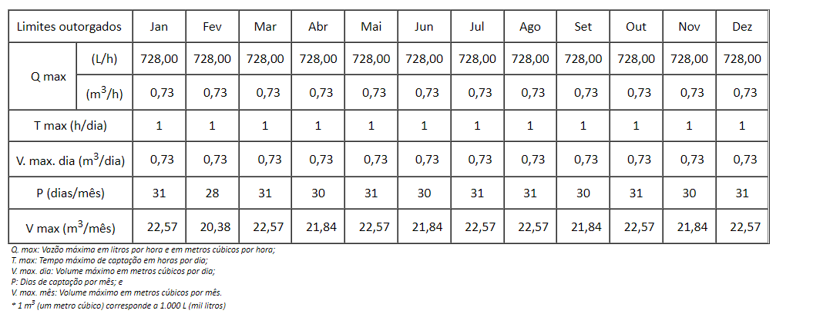

# BANCO DE DADOS ADASA 

## SRID
Coluna geometry no banco de dados:
```
"SHAPE":{
    "srid":4674,"version":1,
    "points":[{"x":-47.55655876199995,"y":-15.81365769499996,"z":null,"m":null}],
    "figures":[{"attribute":1,"pointOffset":0}],
    "shapes":[{"parentOffset":-1,"figureOffset":0,"type":1}],
    "segments":[]
    }
```

## Dados para o parecer de acordo com a planilha modelo:

Vazão Explotável (m³/ano)	N° Poços - Incluindo este ato   | Vazão Total Outorgada por Código - Incluindo a outorga deste ato (m³/ano) | % UTILIZADA	Volume Disponível Atual para Outorga (m³/ano) | Volume Disponível é suficiente para atender a este ato de outorga?
--------- | ------ | ------ | -----
number | number | number | string
number | number | number | string


## Reserva explotável
De acordo com as planilhas o cálculo da vazão explotável:<br>
Explotável(RE) (m³/ano) - RE=RR+RPD

## Colunas do sistema fraturado e poroso

Freático - Pororso

 ```
 Fields:
(...)
RP ( type: esriFieldTypeInteger , alias: RP )
RR ( type: esriFieldTypeInteger , alias: RR )
(...)
Cod_plan ( type: esriFieldTypeString , alias: Cod_plan , length: 20 )
Shape ( type: esriFieldTypeGeometry , alias: Shape )

```
Fraturado - Tubular

```
Fields:
(...)
RR_cm_ano ( type: esriFieldTypeDouble , alias: RR_cm_ano )
(...)
RPR_cm_an ( type: esriFieldTypeDouble , alias: RPR_cm_an )
(...)
RP_cm_ano ( type: esriFieldTypeDouble , alias: RP_cm_ano )
(...)
RPD ( type: esriFieldTypeDouble , alias: RPD )
(...)
Cod_plan ( type: esriFieldTypeString , alias: Cod_plan , length: 20 )
Shape ( type: esriFieldTypeGeometry , alias: Shape )

```

Como exemplo, Cod_plan: "001_01_F":

```
 "attributes": {
    "OBJECTID": 91,
    "uh_nome": "Alto Rio Samambaia",
    "uh_codigo": 1,
    "bacia_nome": "Bacia Hidrográfica do Rio São Marcos",
    "UH_LABEL": "UH 1",
    "NOME": "MNPcf",
    "Hidrogeo": "F",
    "Vazão": 7.5,
    "Area_sq_m": 46607303.737400003,
    "Sistema": "Canastra",
    "Subsistema": "F",
    "REF": 0.050000000000000003,
    "RR_cm_ano": 3379029.5210000002,
    "Esp_raso": 50,
    "Ifr": 0.0050000000000000001,
    "RPR_cm_an": 11651825.93,
    "Esp_profun": 80,
    "Ifp": 0.0030000000000000001,
    "RPP_cm_an": 11185752.9,
    "RP_cm_ano": 22837578.829999998,
    "F_RPD": 5,
    "RPD": 11418.789419999999,
    "RE_cm_an": 4520908.46,
    "Cod_plan": "001_01_F",
    "Shape.STArea()": 0.0039311598669087289,
    "Shape.STLength()": 0.27856378592300618
   },
```

Caso de estudo, usuário Renato 


| Buscar processo n°:\*                 | 19700005170/2018          |  |
|---| --- | --- |
||||||
| Processo cadastrado?  | Sim   ||||
||||||
| Nome do usuário: | RENATO SÉRGIO LYRIO MELLO |
| Número de interferências: | 1 ||||
| Número do ato: | 0010/2020|                                                                     |||
| Situação do ato:| OUTORGADO||||
| Tipo de outorga:| OUTORGA DE DIREITO DE USO ||||
| Vazão anual (L/ano):                  | 265.720 |                                                                     |||
| Vazão anual (m³/ano):| 266 || | |
|                                       |                           |                                                                     |  |  |
| Vazão máxima outorgada (L/h):         | 728                       |                                                                     |  |  |
|                                       |                           |                                                                     |  |  |
| Código do polígono:                   | 037\_12\_R4               |                                                                     |  |  |
|                                       |                           |                                                                     |  |  |
| Número de interferências no polígono: | 160                       |                                                                     |  |  |
|                                       |                           |                                                                     |  |  |
| Vazão outorgada no código (L/ano):    | 2.098.275.310             |                                                                     |  |  |
| Vazão outorgada no código (m³/ano):   | 2.098.275                 |                                                                     |  |  |


### Outroga no SEI



Cálculos: 
V max (m³/ano) * 12 = ?

|V max (m3/mês)|22,57|20,38|22,57|21,84|22,57|21,84|22,57|22,57|21,84|22,57|21,84|22,57|
|---|---|---|---|---|---|---|---|---|---|---|---|---|

calcular o somatório destes meses...


## Cálculos para o gráfico: 

 [jan-dez] vazao_lh -> vazão (l/h)

  [jan-dez] vazao_mh -> vazão jan-dez (m³/h) -> FÓRMULA: vazao_lh/1000

  [jan-dez] tempo_h  tempo de bombeamento (h)

  [jan-dez] vol_max_md -> vol max dia (m³/dia) -> FÓRMULA: vazao_mh * tempo_h

  [jan-dez] periodo_dm -> periodo (dias/mês)

  [jan-dez] vol_m_mm -> vol mensal (m³/mês) -> FORMULA: vazao_mh * tempo_h * periodo_dm

  valores únicos:

  vol_a_ma -> somatorio vol_m_mm -> Volume Anual Requerido (m³/ano)	Código	Vazão Explotável (m³/ano)

## Valores do codigo Cod_plan:

    Vazão Explotável (m³/ano)
    N° Poços - Incluindo este ato	
    Vazão Total Outorgada por Código - Incluindo a outorga deste ato (m³/ano)	
    % UTILIZADA	Volume Disponível Atual para Outorga (m³/ano)
    Volume Disponível é suficiente para atender a este ato de outorga? sim ou não


